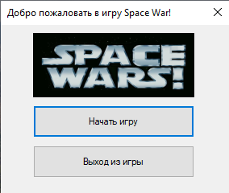
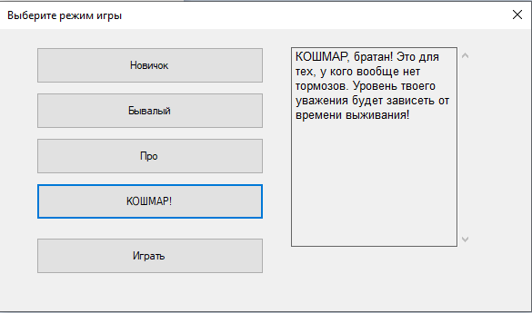
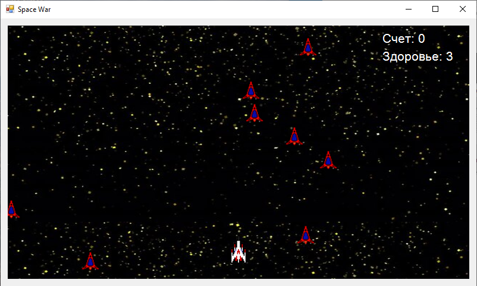
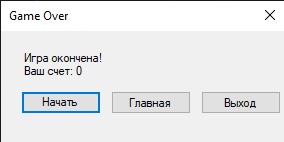

# Игра "Space_War_on_CSharp"

Данное приложение было выполнено в как итоговая работа по учебной дисциплине "Технологии программирования".

**Тема:** Космические войны.

**Суть:** Космический корабль игрока должен уничтожить максимальное количество надвигающихся вражеских космических кораблей, пока враги не уничтожат игрока, сталкиваясь с ним. Корабль игрока может маневрировать влево и вправо, чтобы уворачиваться от столкновения с вражескими кораблями.

## Картинки

Рисунок 1 – Окно "Главное меню"

Рисунок 2 – Окно "Меню выбора режима"

Рисунок 3 – Окно "Демонстрация игрового процесса"

Рисунок 4 – Окно "Конец игры"

